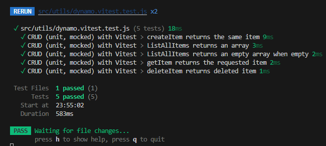

# Unit Testing 2

An introduction to AWS client-mock with unit testing

## Goals

- Implementing DynamoDB helpers
  - AWS SDK v3 & DocumentClient
- Writing unit tests that mock AWS calls
- Return values of tests

## Setup

- Dependency installation

``` javascript
npm install --save-dev vitest @testing-library/react @testing-library/jest-dom jsdom

npm i @aws-sdk/client-dynamodb @aws-sdk/lib-dynamodb

npm i -D vitest aws-sdk-client-mock
```

- Configure `vite.config.js`

``` javascript
import { defineConfig } from 'vite';
import react from '@vitejs/plugin-react';

export default defineConfig({
  plugins: [react()],
  test: {
    environment: 'jsdom',
    globals: true
  }
});
```


- Add test script to `package.json`

``` JSON
{
  "scripts": {
    "test": "vitest"
  }
}
```

- Create `dynamo.js` and `dynamo.vitest.test.js` for test library imports, functions, and written tests

## Tasks and Criteria

### Required Tests

- createItem happy path
- listAllItems happy path
- listAllItems when Items is missing/error
- 1-2 more tests for helpers of your choice

### Commands and Imports

- DynamoDBDocumentClient, PutCommand, ScanCommand, GetCommand, DeleteCommand
- createItem, listAllItems, getItem, deleteItem

